# Frontend Architecture & UI Showcase

A collection of frontend projects developed throughout my learning journey, covering HTML, CSS, SCSS, and Bootstrap. The repository highlights practical implementations of responsive design, layout architecture, styling methodologies, animation systems, and modern user interface patterns across a variety of real-world application concepts.

## 🚀 Projects

<table>
<tr>
<td width="50%" valign="top">

### 📰 Blog

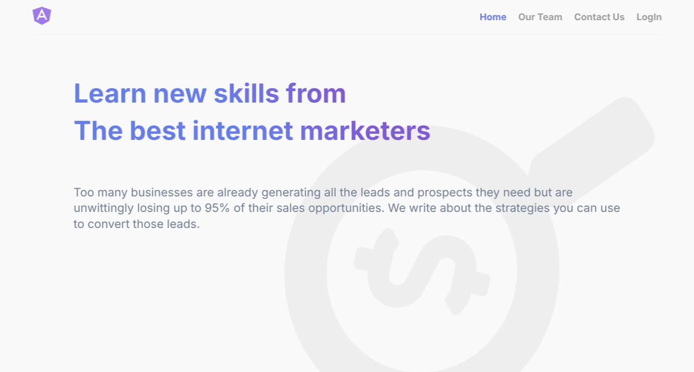

Typography-focused reading experience with semantic content structures and responsive article layouts.

**Tech:** HTML5 · CSS3

</td>

<td width="50%" valign="top">

### 🏢 Convention Center

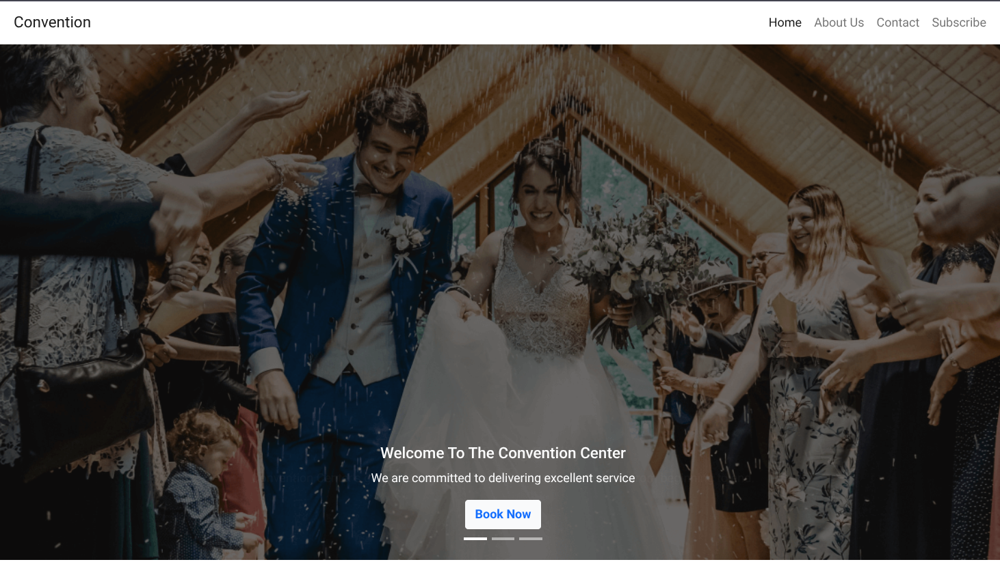

Event platform featuring pricing plans, session schedules, booking workflows, and responsive Bootstrap layouts.

**Tech:** Bootstrap · CSS

</td>
</tr>

<tr>
<td valign="top">

### 🎓 eSchool Platform

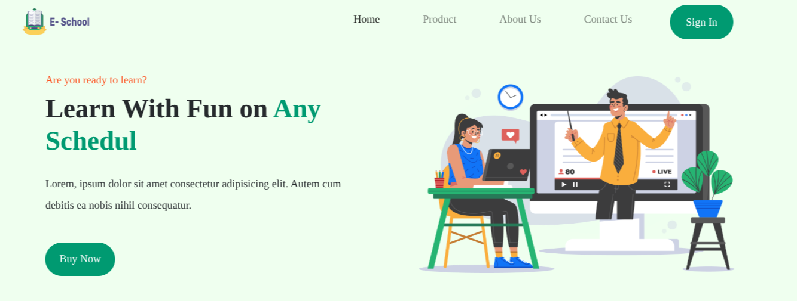

Modern educational landing page showcasing courses, features, and conversion-focused sections.

**Tech:** HTML5 · CSS3 · Flexbox

</td>

<td valign="top">

### 🎨 Natours

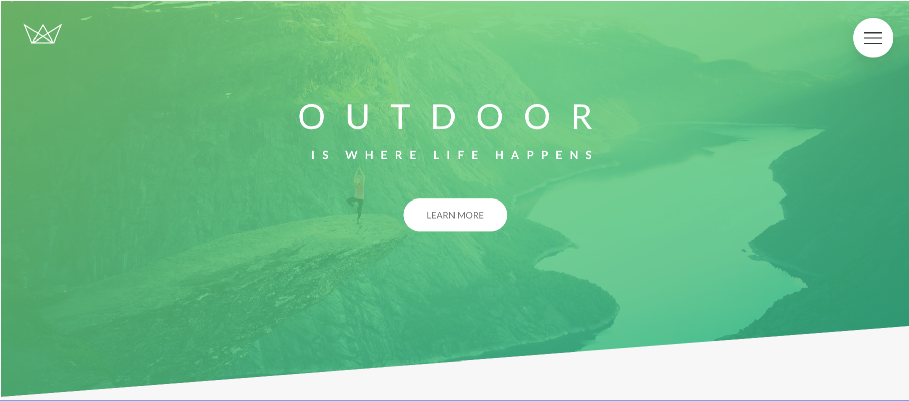

SCSS architecture playground exploring mixins, maps, loops, and reusable styling systems.

**Tech:** SCSS · Dart Sass

</td>
</tr>

<tr>
<td valign="top">

### 📦 Flexbox Sandbox

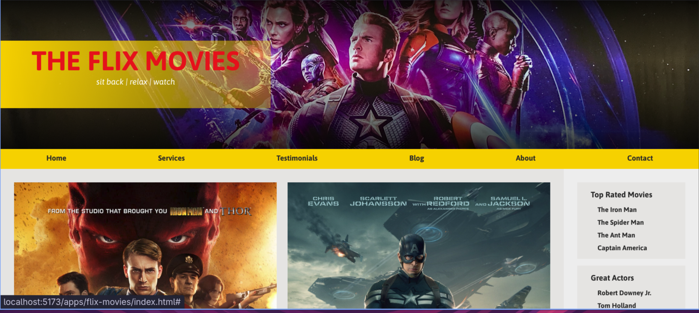

Interactive laboratory for understanding Flexbox alignment, growth, wrapping, and distribution patterns.

**Tech:** CSS3 Flexbox

</td>

<td valign="top">

### 🛍️ Flone E-Commerce

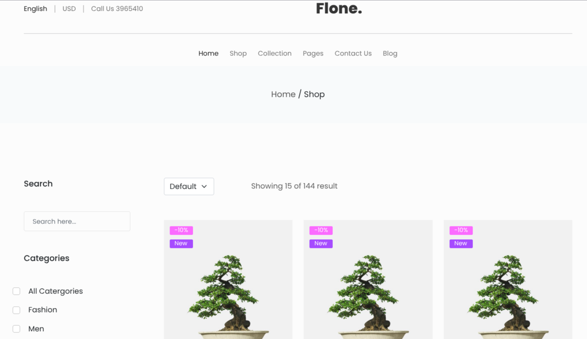

Production-inspired storefront with modular Sass architecture and scalable commerce UI patterns.

**Tech:** Sass · E-Commerce UI

</td>
</tr>

<tr>
<td valign="top">

### ⚽ Football Portal

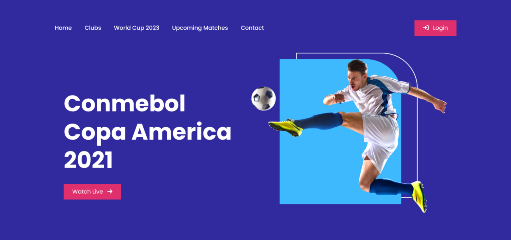

Sports dashboard showcasing match statistics, news feeds, standings, and layered grid layouts.

**Tech:** CSS Grid

</td>

<td valign="top">

### 🖥️ Microsoft Home Clone

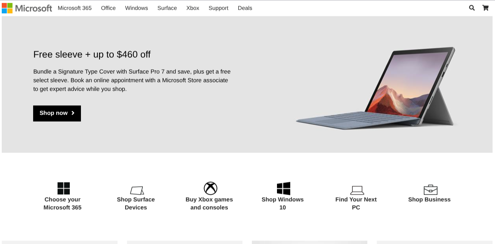

Pixel-perfect recreation emphasizing layout precision, responsive behavior, and design consistency.

**Tech:** HTML5 · CSS3

</td>
</tr>

<tr>
<td valign="top">

### 🏠 Nexter Real Estate

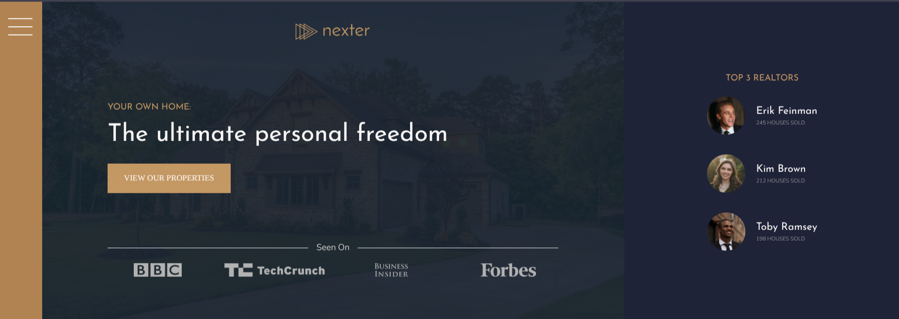

Premium real estate dashboard built with advanced CSS Grid techniques and editorial layouts.

**Tech:** SCSS · CSS Grid

</td>

<td valign="top">

### 🛒 Panda Commerce

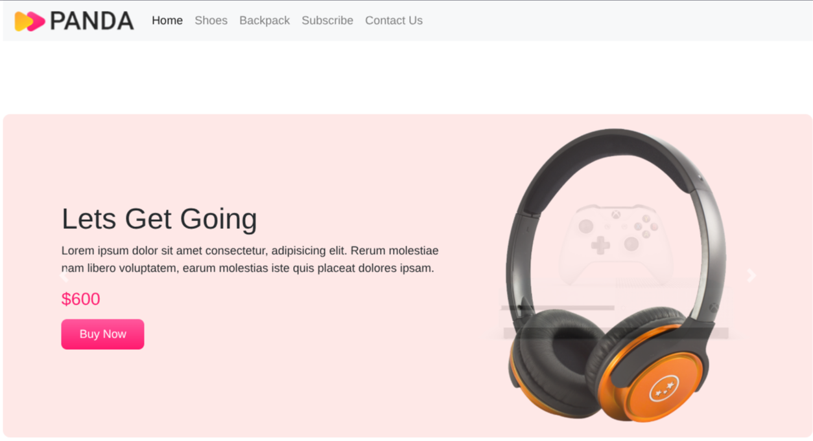

Classic e-commerce storefront featuring product showcases, banners, and responsive shopping layouts.

**Tech:** HTML5 · CSS3 · Flexbox

</td>
</tr>

<tr>
<td valign="top">

### 👨‍💻 Personal Hub Website

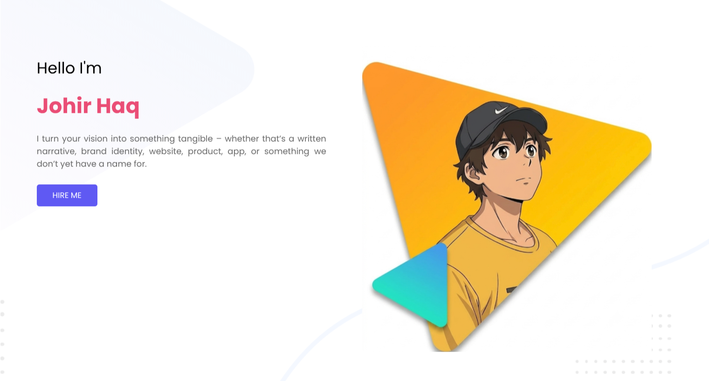

Centralized portfolio hub connecting projects, social platforms, and personal branding content.

**Tech:** HTML5 · CSS3

</td>

<td valign="top">

### 📁 Project Portfolio

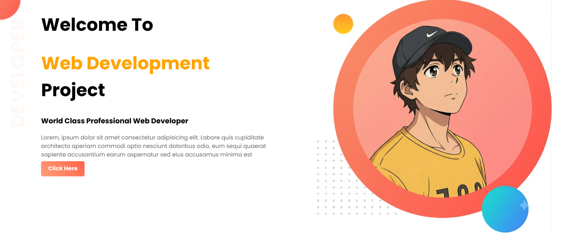

Interactive showcase highlighting projects, timelines, and frontend development experiments.

**Tech:** CSS Grid · Flexbox

</td>
</tr>

<tr>

<td valign="top">

### 📄 Simple Portfolio

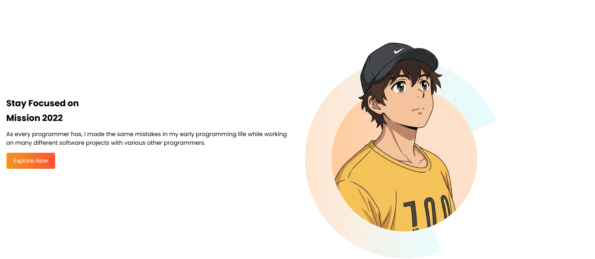

Minimal portfolio experience designed around simplicity, readability, and clean presentation.

**Tech:** HTML5 · CSS3

</td>
</tr>

</table>

---

## Technologies

```text
HTML5
CSS3
SCSS / Sass
Bootstrap
Flexbox
CSS Grid
Responsive Design
Animation & Transitions
```

---

## Highlights

🎨 Modern UI/UX patterns

⚡ CSS Grid & Flexbox deep dives

🎬 Animation and interaction experiments

🏗️ Scalable Sass architecture

---

## Purpose

This repository documents my frontend development journey through hands-on projects focused on building polished, responsive, and maintainable user experiences.

Each application represents a practical exploration of a specific design system, layout strategy, or interface pattern commonly found in modern web products.
